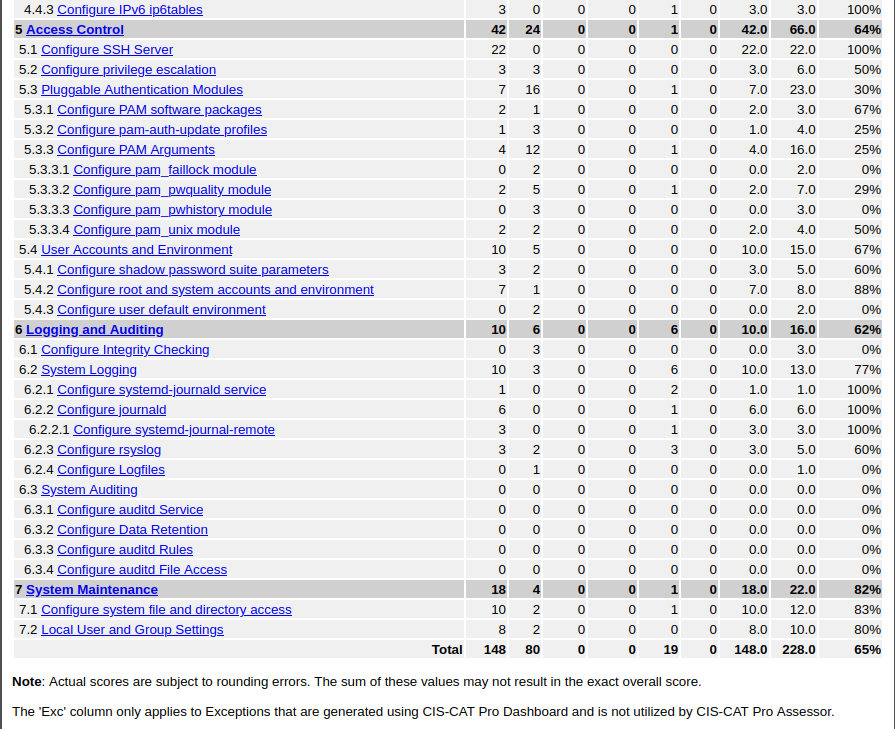

# Ubuntu 20.04 CIS Hardening

## Overview

This project demonstrates practical system hardening of an Ubuntu 20.04 machine using the **CIS Benchmarks** and the **CIS-CAT Lite** assessment tool. The goal was to evaluate the default security posture of a fresh Ubuntu install, apply targeted remediations, and raise the compliance score while balancing security with usability.

## Objectives

- Assess the initial compliance level of Ubuntu 20.04 against the CIS Level 1 Benchmark.
- Apply selective hardening based on CIS-CAT recommendations.
- Increase the compliance score while maintaining system functionality.
- Understand the trade‑offs between strict security policies and real‑world usability.

## Technologies Used

- **Operating System**: Ubuntu 20.04 LTS (virtualized)
- **Assessment Tool**: CIS‑CAT Lite (CLI mode)
- **Benchmark**: CIS Ubuntu Linux 20.04 LTS Benchmark v1.0.0 – Level 1 (Workstation)
- **Hardening Areas**: Authentication policies, service management, kernel parameters, file permissions, firewall (UFW), auditing (auditd)

## Architecture



  
*Running CIS-CAT to generate a compliance report.*

The process follows a simple loop:  
1. Run CIS-CAT against the target system.  
2. Analyze the HTML report to identify non‑compliant items.  
3. Apply remediation steps (manually or via scripts).  
4. Re‑assess to measure improvement.

## Setup & Installation

### Prerequisites

- Ubuntu 20.04 system (physical or VM) with at least 2 GB RAM, 10 GB disk.
- Java Runtime Environment (JRE) installed:
  ```bash
  sudo apt update && sudo apt install default-jre -y
  java -version

    Download CIS‑CAT Lite from the CIS WorkBench (free account required).

Step-by-Step

    Extract CIS‑CAT
    bash

    unzip CIS-CAT-Lite.zip -d ~/cis-cat
    cd ~/cis-cat

    Run an assessment
    bash

    ./CIS-CAT.sh -a -b benchmarks/CIS_Ubuntu_Linux_20.04_LTS_Benchmark_v1.0.0-xccdf.xml \
                 -p "Level 1 (Workstation)" -rd ./reports

    This generates an HTML report in the reports/ folder.

    Review the report
    Open the HTML file in a browser to see which checks passed/failed and read remediation advice.

    Apply remediations
    For each failed item, decide whether to fix it. Use the provided remediation steps (e.g., edit /etc/login.defs, disable a service with systemctl, adjust sysctl parameters).

    Re‑assess
    Rerun CIS‑CAT to confirm the changes improved your score.

    Note: Full automation of remediations is possible with configuration management tools (Ansible, Puppet) – a future enhancement.

Configuration Highlights

Key changes made during hardening (examples):

    Password policy – Enforced in /etc/login.defs and /etc/pam.d/common-password.

    Disable unused services – e.g., cups, avahi-daemon:
    bash

    sudo systemctl stop cups && sudo systemctl disable cups

    Kernel hardening – Added to /etc/sysctl.conf:
    text

    net.ipv4.conf.all.rp_filter = 1
    net.ipv6.conf.all.disable_ipv6 = 1

    File permissions – Secured critical files like /etc/shadow (640) and /etc/group (644).

    Firewall – Configured UFW to deny incoming by default, allow only necessary ports.

Full configuration files (where applicable) are placed in the configs/ directory.
Testing & Results
Metric	Before Hardening	After Hardening
CIS Compliance Score	~47%	75%
Improvement	–	+28%


We prioritised fixes that gave the biggest security gain with minimal impact on daily use. Some recommendations were deliberately skipped (e.g., removing essential packages, disabling update services) to keep the system practical.
Lessons Learned

    CIS benchmarks are rigorous – They provide excellent guidance but must be interpreted contextually. Blindly following every rule can break functionality.

    Security is about trade‑offs – Full compliance often clashes with usability, especially in development or lab environments.

    Hardening is continuous – A one‑time effort is not enough; re‑assessment after updates is necessary.

    Manual remediation is time‑consuming – Achieving 75% required hours of work across multiple OS layers. Automation would greatly improve efficiency.

    Tools like CIS‑CAT are guides, not gospels – They identify gaps, but the final decision on what to fix rests on your risk tolerance and system role.

Future Improvements

    Automate remediations using Ansible playbooks to make hardening repeatable and faster.

    Integrate with a vulnerability scanner (e.g., Nessus) to correlate findings.

    Test on different Ubuntu versions (22.04, 24.04) and compare results.

    Create a “baseline” hardened image for quick deployment of new systems.

Author
Esso Maléki TONINZIBA
